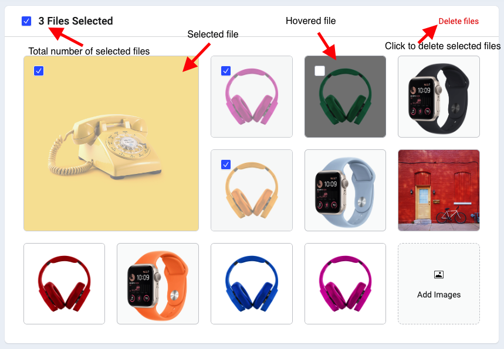

# Image-Gallery

Responsive and draggable image gallery with react.js.

## Core Features:

- Reordering
- Deleting multiple images
- Setting a feature image
- Drag and Drop Feature (Using DnD Kit)

## Core Technologies

- React.js (Using react context and useReducer hook together for managing state)

## Available Scripts:

1. Git Clone :
2. cd to Image Gallery
3. npm install
4. npm run dev

## Project live link:

## Project Demo Image:

